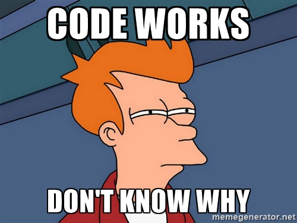

# Type systems
### will make you a better
### JavaScript programmer

by Jared Forsyth


Note:
Hi, I'm Jared Forsyth, and I'll be talking about how Type Systems will make
you a better JavaScript Programmer.

I work at Khan Academy, and we're working to create a free, world-class
education for anyone, anywhere!
I work on the mobile team, which means that in addition to JavaScript, I write
Java, Objective C, and Swift! Which are all compiled languages that have much
more developed type checking than JavaScript.

So I've seen both sides -- the
flexibility that JavaScript provides, and the power and security that working
in one of these compiled langauges gives you.

And I think that adding a powerful type system to your JavaScript brings a ton of benefits.

---

### Cool things I like

<table>
<tr>
<td>structured editors</td>
<td>algebraic effects</td>
</tr>
<tr>
<td>continuous integration</td>
<td>continuations</td>
</tr>
<tr>
<td>algebraic data types</td>
<td>react native</td>
</tr>
<tr>
<td>reason/ocaml</td>
<td>editor tooling</td>
</tr>
</table>

---

### Why you want more type errors
### How to get more type errors
### Thinking with types
### ...beyond

Note:
So what's this about?

First I'll give a brief overview of javascript's type system, and how it
doesn't give us nearly enough type errors.

Then I'll go into different ways we can get more type errors :D e.g. detect
the errors that are in our code.

Then we'll talk about how thinking with types will improve your code, make
your coworkers happier and improve your peace of mind.

Finally I'm going to talk about how having a powerful type system changes the
way that you code, to make it safer, more readable, and more maintainable.

buut then I'll go into what lies beyond hahaha

---

## More type errors!


Note:
You've probably been thinking that what you want is fewer errors, but in fact!
What you want is more.

Let's define some terms here first.

---

### What is a type?

- a group of things
- that can be used interchangeably

Note: In very broad terms, you can think of a type as a group of things that
can be used interchangeably.

---

### What is a type?

- numbers (`a * b, x - y`)
- strings
- things that have a `name` attribute

Note: Numbers can all be validly added together, subtracted, and
multiplied. Strings can be split, joined, and displayed to the screen.
And we could also talk about "thinks that have a `name` attribute, as being a
type.

---

### JavaScript has a type system!

`typeof x`

<table>
<tr>
<td>number</td>
<td>string</td>
</tr>
<tr>
<td>boolean</td>
<td>undefined</td>
</tr>
<tr>
<td>function</td>
<td>symbol</td>
</tr>
<tr>
<td>object</td>
</tr>
</table>

---

### What are type errors?

when you try to use a thing in a context where it doesn't work.

Note: So a type error, for my purposes, is "when you try to use a thing in a
context where it doesn't work".

And that can mean different things to different language runtimes.

For example, if you pass a number in to a place that expects something with a `name`
attribute, that's wrong! So I'd consider that a type error, but JS doesn't. So
type errors depend on the context, language runtime, etc.

---

### JavaScript has (runtime) type errors!
but not nearly as many as one would want.

- `_ is not a function`
- `cannot read property '_' of null/undefined`

Note: JavaScript has very few kinds of type errors; they're triggered when you
try to call something that's not a function, and when you try to get an
attribute of null or undefined.

And this limited vocabulary for expressing errors has two unfortunate
outcomes.

---

### Either you get weird type errors late

```js
  var x = 10
  var y = x.parent
  // ^ the real error is thinking `x` has a `.parent`
  return y.name
  // ^ but JS gives us the error here
```

Note: In this trivial example, the actual bug is relatively close to the
exception that JavaScript gives us. But all to often in real-world projects,
the place where JavaScript figures out something has gone wrong is far removed
from the actual source of the error.

---


---

### ...or no errors at all

```js
function doSomething(m) {
  // numbers don't have a count
  if (m.count > 2) {
    return "large"
  } else {
    return "small"
  }
}
// but js will happily return "small" here
doSomething(5)
```

Note: Even more insidious is when JavaScript doesn't throw an error at all,
because it tries its best to figure out what you meant and manages to avoid
anything it considers a type error.

These are frequently even harder to debug, because you don't have an
`exception` stack trace to get you started. You just have to pause in the
middle of a running session and try to figure out how your data got so weird.

---



---

### JavaScript tries to avoid errors

```
2/'' === Infinity
2 + {} === '2[object Object]'
2 + 'phone' -> NaN
alert(1, 2, 3, 4, 5)
```

but it backfires

Note: So what does JavaScript do? It tries to figure out what you meant,
giving you the benefit of the doubt that you probably didn't write a bug. This
ends up backfiring big time, because it makes it much harder to diagnose
problems.

---

## How to get more type errors

- linters
- custom runtime type checking
- static type checking

Note:
These first two are pretty commonly used, but I'm going to make the case that
static type checking is really the best of both worlds.

TODO animate in?

---

## Linters

Note: you might be thinking "Linters? They don't have anything to do with
types". But in fact they know about 2 types: declared and "not declared"

Umm maybe cut this section?

---

### Linters know about 2 types

- declared
- not declared

```js
function doSomething(argument) {
  return brgment + 1 // ERROR brgment is never declared
}
```

Note:
And using a variable that's never declared in non-strict javascript is a
disaster waiting to happen. Even in "strict mode", you won't know about the
error until runtime when the code gets executed.

TODO animate between

---

### Linters

<table>
<tr><td>+ runs ahead of time</td></tr>
<tr><td>+ very little work</td></tr>
<tr><td>- very rudimentary</td></tr>
</table>

---

### Custom runtime type checking

Sometimes useful, frequently annoying.

```js
// `greet` takes 3 arguments:
// a string, a list, and a number

// Valid usage
greet("hello", ["June"], 10)
greet("hello", ["June", "July"], 10)

// Should be errors
greet()
greet("hello", "June")
greet(1, 2, 3, 4, 5, 6)
```

Note: Say you have a function `greet`, which takes three arguments

Now, what are situations in which a function would be called with incorrect
arguments? Hopefully not immediately on the day you write it (although that
does happen). But over the lifetime of a project, things get refactored,
variables get added, removed, reused. And suddently it takes a lot of effort
during a refactor to make sure you're just calling functions with the correct
arguments!

---

### Custom runtime type checking

Sometimes useful, frequently annoying.

```js
function greet(greeting, months, age) {
  if (arguments.length !== 3)
    throw new Error('must be called with 3 arguments')
}
```

---

### Custom runtime type checking

Sometimes useful, frequently annoying.

```js
function greet(greeting, months, age) {
  if (arguments.length !== 3)
    throw new Error('must be called with 3 arguments')
  if (typeof greeting !== 'string')
    throw new Error('greeting must be a string')
  if (!Array.isArray(months))
    throw new Error('months must be an array')
  if (typeof age !== 'number')
    throw new Error('age must be a number')
}
```

Note: If you're using runtime type checks to do things that a type checker
  would do for you, you're wasting a ton of time.

  This is defensive programming, right? And if you're super into this there
  are libraries that will check schemas at runtime to take away some of the
  boilerplate.

---

### Custom runtime type checking

<table>
<tr><td>+ very powerful</td></tr>
<tr><td>- lots of extra boilerplaty code</td></tr>
<tr><td>- only at runtime</td></tr>
</table>

---

### React propTypes

Runtime type checking, but less annoying.

```
const MyThing = React.createClass({
  propTypes: {
    greeting: PropTypes.string,
    months: PropTypes.arrayOf(PropTypes.string),
    person: PropTypes.shape({
      name: PropTypes.string,
    })
  },
})
```

Note:
With PropTypes, we have runtime type checking, and it's been pretty
streamlined.
BUT
only for react components, not all functions
also runtime-only, although the react-eslint plugin will check your proptypes
definition against your props usage & make sure that at least all of the props
you use are listed there.

---

### React propTypes

<table>
<tr><td>+ not too much extra code</td></tr>
<tr><td>+ free documentation</td></tr>
<tr><td>- only at runtime</td></tr>
<tr><td>- only for React Components</td></tr>
</table>

Note: documentation, but it might be wrong b/c you haven't updated the prop
types, and maybe you haven't rendered the thing in that configuration
recently.

---

## Static type checking
with flow!

<a href="https://flowtype.org/" style="font-size: 70%" >flowtype.org</a>

---

### Setup

- grab a plugin for your favorite IDE
- install flow (`npm install -g flow-bin`)
- add `// @flow` to the top of a js file

Note:
webstorm supports natively, and there are really great plugins for vscode,
atom, vim, etc.

Flow puts a big emphasis on supporting incremental adoption. To start using it
on a file, you just add the comment at the top. And immediately from there,
Flow will infer the types of values and functions in that file & let you know
about errors there. You can then add annotations to improve readability and
lock down anything that flow can't infer.

---

### Static type checking

```js
//                argument type  return type
function sayHello(name: string): string {
  return "Hello " + name
}
 
 
 
 
 
 
//
```

---

### Static type checking

```js
//                argument type  return type
function sayHello(name: string): string {
  return "Hello " + name
}
// you can annotate variables if you want
const age: number = 10
// but flow's clever enough to infer most things
const notherAge = 10
//    ^ flow knows that notherAge is a number

//
```

---

### Static type checking

```js
//                argument type  return type
function sayHello(name: string): string {
  return "Hello " + name
}
// you can annotate variables if you want
const age: number = 10
// but flow's clever enough to infer most things
const notherAge = 10
//    ^ flow knows that notherAge is a number
const greeting = sayHello("React")
//    ^ flow knows that greeting is a string!
```

---

### Static type checking

```js
// actually we can leave these out, flow's got it
function sayHello(name) {
  return "Hello " + name
}
// you can annotate variables if you want
const age: number = 10
// but flow's clever enough to infer most things
const notherAge = 10
//    ^ flow knows that notherAge is a number
const greeting = sayHello("React")
//    ^ flow knows that greeting is a string!
```

---

### Static type checking
vs custom runtime checking

```js
function greet(greeting, months, age) {
  if (arguments.length !== 3)
    throw new Error('must be called with 3 arguments')
  if (typeof greeting !== 'string')
    throw new Error('greeting must be a string')
  if (!Array.isArray(months))
    throw new Error('months must be an array')
  if (typeof age !== 'number')
    throw new Error('age must be a number')
}
```

```js
function greet(greeting: string,
               months: Array<string>,
               age: number) {
}
```

---

### Static type checking
vs React propTypes

```
class MyThing extends Component {
  static propTypes = {
    first: PropTypes.number,
    second: PropTypes.arrayOf(PropTypes.string),
    third: PropTypes.shape({
      name: PropTypes.string,
    })
  }
}
```

```
class Component extends MyThing {
  props: {
    first: number,
    second: Array<string>,
    third: {
      name: string,
    }
  }
}
```

---

### Static type checking

<table>
<tr><td>+ runs ahead of time</td></tr>
<tr><td>+ not much boilerplate</td></tr>
<tr><td>+ applies to all fns, variables, etc.</td></tr>
<tr><td>+ free documentation, never stale</td></tr>
</table>

---

### Getting more type errors in JS

<table>
<thead>
  <tr>
  <td/>
  <th>Linter</th>
  <th>Custom</th>
  <th>PropTypes</th>
  <th>Flow</th>
  </tr>
</thead>
<tr>
  <th>When do you know?</th>
  <td>now</td>
  <td>runtime</td>
  <td>runtime</td>
  <td>now</td>
</tr>
<tr>
  <th>How easy</th>
  <td>😄</td>
  <td>🚫</td>
  <td>😊</td>
  <td>🙂</td>
</tr>
<tr>
  <th>Where can it be used?</th>
  <td>🙂</td>
  <td>😄</td>
  <td>🚫</td>
  <td>😄</td>
</tr>
<tr>
  <th>How helpful</th>
  <td>🚫</td>
  <td>😊</td>
  <td>🙂</td>
  <td>😄</td>
</tr>
<tr>
  <th>Readability</th>
  <td/>
  <td>🚫</td>
  <td>🙂</td>
  <td>😄</td>
</tr>
</table>

Note: I like tables, because they allow me to show, unequivocally, that the
thing I like is better than other things :D

---

### Reactions to Flow @ KA

- 😄 when adding flowtypes to code, it finds bugs!
- 👎 editor integration is confusing
- 😄 feel much safer making changes as a team
- 😄 code is self-documenting!
- 👎 new syntax + esnext can be overwhelming

Note: At Khan Academy, we've recently started using Flow in our production
JavaScript, and on the whole we've been very happy with the results.

---

## Thinking with types

Note: So I've just gone over the ways we can get more informative type errors,
which will help us
- track down bugs to their actual source
- document our code & understand how functions are to be used
- refactor with confidence

But now I want to talk about how it will change the way you program.

---

### Thinking with types

- clever code
- implicit invariants
- implicit state machines

Note:

One of the things I've run into when adding flow to an existing project is
that there are some functions where it's really hard to come up with a type
that will satisfy `flow`. Nearly every time, I think about it a little &
realize that the function is being too clever.

---

## Clever code

Note: There is a ton of valid javascript that flow would reject; so if we're
restricting ourselves, what are we gaining?

Code that flow can type is also code that other people will be able to
understand better.

---

> Everyone knows that debugging is twice as hard as writing a program in the first place.
> So if you're as clever as you can be when you write it, how will you ever debug it?
> - Brian Kernighan

---

### Clever code

clever
```js
  props['on' + (fastClick ? 'MouseDown' : 'Click')] = myFn
```

unclever
```js
  if (fastClick) {
    props.onMouseDown = myFn
  } else {
    props.onClick = myFn
  }
```

---

### Clever code

```js
  function doAllTheThings(first, second, third) {
    if (third === undefined) {
      third = second
      first = {options: first}
    }
  }
```

```js
  function doAllTheThings(isBoolean, data) {
    if (isBoolean) { // data is a boolean
    } else { // data is a string
    }
  }
```

---

> If it's hard to type check, it's probably hard to understand

---

## Implicit invariants

---

### Implicit invariants

```js
  state: {
    loading: boolean,
    error: ?string,
    data: ?SomeObject,
  }
  render() {
    if (this.state.loading) return ...
    if (this.state.error || this.state.data) return ...
    return <button onClick={this.onClick}>
      Click me!
    </button>
  }
```

Note: frequently we have React components that are really representing little
state machines. Here's an example that might look familiar -- we have a
component that fetches some data, and so it starts out loading, and it will
either display an error on failure or display the data in some wonderful way.

---

### Implicit invariants

```js
  onClick = () => {
    // Flow errors: "this.state.data might be null"
    alert(this.state.data.name)
  }
  render() {
    if (this.state.loading) return ...
    if (this.state.error || this.state.data) return ...
    return <button onClick={this.onClick}>
      Click me!
    </button>
  }
```

---

### Implicit invariants

```js
  onClick = () => {
    if (!this.state.data)
      throw new Error('lol this will never happen')
    alert(this.state.data.name)
  }
  render() {
    if (this.state.loading) return ...
    if (this.state.error || this.state.data) return ...
    return <button onClick={this.onClick}>
      Click me!
    </button>
  }
```

Note: Here's one way to fix it! If you find yourself doing this, it's a huge
warning sign.

"Of course it's not null" you think, "this callback function couldn't have
been triggered if data wasn't present!"

so what do we do here? How can we get flow off our backs by proving to
it that, if the button w/ the onClick handler was rendered, then
`this.state.data` is definitely true?

---

### Implicit invariants

```js
  render() {
    if (this.state.loading) return ...
    if (this.state.error || this.state.data) return ...
    return <TheContents data={this.state.data} />
  }
}
class TheContents extends Component {
  onClick = () => {
    alert(this.props.data.name) // props.data is never null!
  }
  render() {
    return <button onClick={this.onClick}>Click me!</button>
  }
```

Note: Make a child component that gets `this.state.data` as props *only when it's
present*, and it will be clearer to flow *and to readers*.

Also: this doesn't just apply to state. You could have an optional
thing come in as props, and if you want a scope in which you know that it
will always be non-null, make a child component!

The point I want to drive home here is: If you didn't have flow watching
your back, yes it would save you the trouble of adding the extra layer, but
your code would be *more* complicated & less readable as a result. You would
have to keep more things in your head ("is X initialized yet?") as a result,
and you'd have more bugs.

---

## Implicit state machines

Note:


---

### Example: KA mobile app

<div style="display: flex; flex-direction: row; align-items: flex-end;
font-size: 20px; justify-content: center">
<div style="display: block">
<div>Loading</div>

</div>
<div>
<div>Answering</div>

</div>
<div>
<div>Finished</div>

</div>
</div>

---

### The naive state representation

```js
type State = {
  loading: boolean,
  problems: ?Array<Problem>,
  answers: ?Array<Answer>,
  currentProblem: number,
  pointsData: ?PointsData,
}
```

Note: So here's the naive way of representing the state involved - we just
think of all the information we need to track and we throw it on there.

It's common to just start with an empty object and throw things on as
you need them.

Here's a hypothetical object that would manage the state of a quiz that a
learner is taking on Khan Academy. There are 3 phases of this quiz; first
there's a loading screen while we fetch the questions. Then they're taking
the quiz, going through each question one by one.

Then when they finish there's a success screen, telling them how many points
they got.

---

### The naive state representation

<div style="display: flex; flex-direction: row; align-items: flex-start">
<pre><code class="lang-js">// Loading problems
state = {
  loading: true,
  problems: null,
  answers: null,
  currentProblem: 0,
  pointsData: null,
}

</code></pre>
<pre><code class="lang-js">// Answering
state = {
  loading: false,
  problems: [...some array],
  answers: [...some array],
  currentProblem: 3,
  pointsData: null,
}

</code></pre>
<pre><code class="lang-js">// Finished
state = {
  loading: false,
  // not relevant anymore
  problems: [...some array],
  answers: [...some array],
  currentProblem: 0,
  pointsData: {some data},
}
</code></pre>
</div>

Note: And here's some example data for the different screens I showed.

The problem with this representation is that there are all sorts of illegal
states that will still type check fine.

---

### The naive state representation

Allows illegal states

<div style="display: flex; flex-direction: row; align-items: flex-start">
<pre><code class="lang-js">type State = {
  loading: boolean,
  problems: ?Array&lt;Problem>,
  answers: ?Array&lt;Answer>,
  currentProblem: number,
  pointsData: ?PointsData,
}
</code></pre>
<pre><code class="lang-js">state = {
  loading: false,
  problems: [...some array],
  answers: null, // oops
  currentProblem: 0,
  pointsData: null,
}
</code></pre>
</div>


Note: Based on the type definition, this is a valid state. But as the
programmer writing the code, you think "of course when problems is present,
answers will also be present -- they go together". You might know that, but
flow doesn't know that, and the next developer who comes along also won't
necessarily know that.

---

### Representing the state machine

Make illegal states invalid

```js
// swift-land
enum State {
  case Loading
  case Answering(
    problems: Array<Problem>,
    answers: Array<Answer>,
    currentProblem: int
  )
  case Finished(PointsData)
}
```

Note:
If you were lucky enough to be using an ML-family language like Swift or Rust
or Ocaml, you'd be able to represent the State like this:

---

### Representing the state machine

Make illegal states invalid

```js
// Flow-land, a "tagged union"
type State = {
  screen: 'loading',
} | {
  screen: 'answering',
  problems: Array<Problem>,
  answers: Array<Answer>,
  currentProblem: number,
} | {
  screen: 'finished',
  pointsData: PointsData
}
```

Note: But here in javascript land we've got something similar - a tagged union.

So you can see that the invariant that we previously had to hold inside
our head "whenever problems is present, answers will be also" is now encoded
in the type, and therefore enforced by flow, and more understandable to
maintainers later!

This is a much better representation, because it makes it clear what
things are going to be optional at what times. Without these types, it might
be clear to you as the author that "when you have a questions array you'll
also have an answers array and you won't have earnedBadgeData", but it
certainly won't be clear to a coworker, or to you a month from now.

---

> If you're making a ton of things optional, you're probably trying to
> represent a state machine poorly.

---

# Thinking with types

- clever code
- implicit invariants
- implicit state machines


---

# Beyond incremental typing

Note:
Now, there are a lot of things I love about flow, and I'm very happy that we
have it in our codebases at work, it's not all sunshine and roses.

---

## When 80% typed isn't enough

20% unsafe can very well mean 100% of users see bugs.


---

# PROBALBY NOT

## A Types First Approach

If you have any complex data objects, write out the types before you dive into
coding.

Note: Once you get comfortable with the types that flow gives yu

I've found that there are some types of problems where thinking about the
types first -- specifically the types of the data -- is much better than
diving into the code and adding types later.

We looked at state machines just now. But also in cases where you're passing
messages back and forth, or you're making API calls, or you're displaying
complex data.

Now there are definitely situations where "move fast & type later" is
perfectly valid.

This isn't new -- there are comments in my JavaScript just like this

---

#### A Types First Approach
```js
/**
 * NOTE "post" looks like
 * { title, createdDate, contents, authors }
 * where an author looks like
 * { name, location, numberOfPosts }
 */
```

---

#### A Types First Approach
```js
type Post = {
  title: string,
  createDate: Date,
  contents: string,
  authors: Array<{
    name: string,
    location: string,
    numberOfPosts: number,
  }>,
}
```

---

### When to write Types First?

<table>
<thead>
  <tr><th>Types First</th><th>Types Later</th></tr>
</thead>
<tbody>
  <tr>
<td>
  <ul>
    <li>State machines</li>
    <li>Remote data types</li>
  </ul>
</td>
<td>
  <ul>
    <li>Simple data</li>
    <li>Complex interaction</li>
  </ul>
</td>
</tr>
</tbody>
</table>

---

## Conclusion

- JavaScript doesn't give us enough type errors
- Static type checking can help!
- Working with types will help you think better


---

### FIN

[jaredforsyth.com/type-systems-js-dev](https://jaredforsyth.com/type-systems-js-dev)

